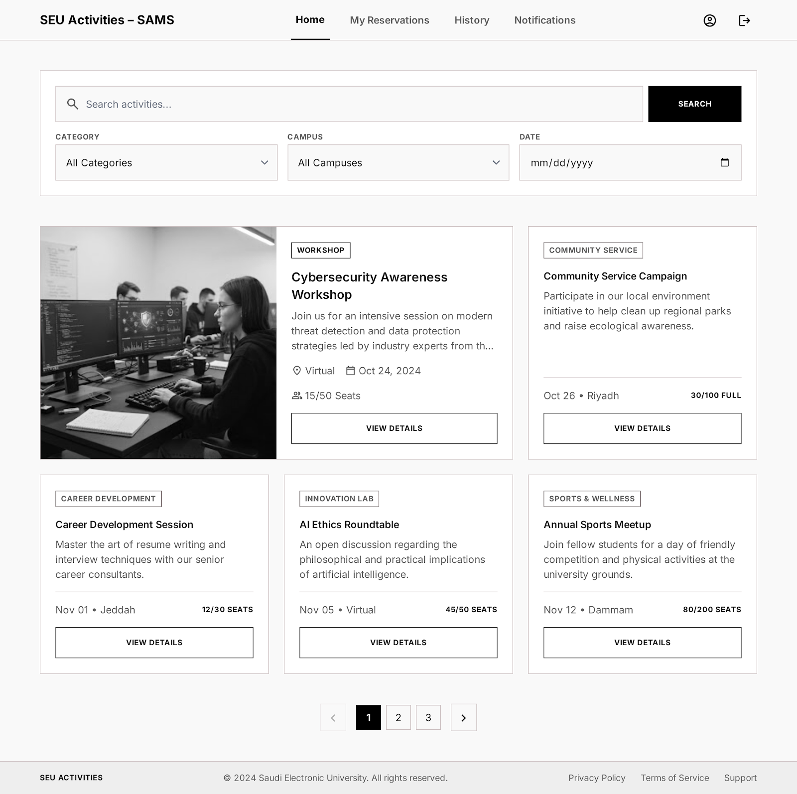
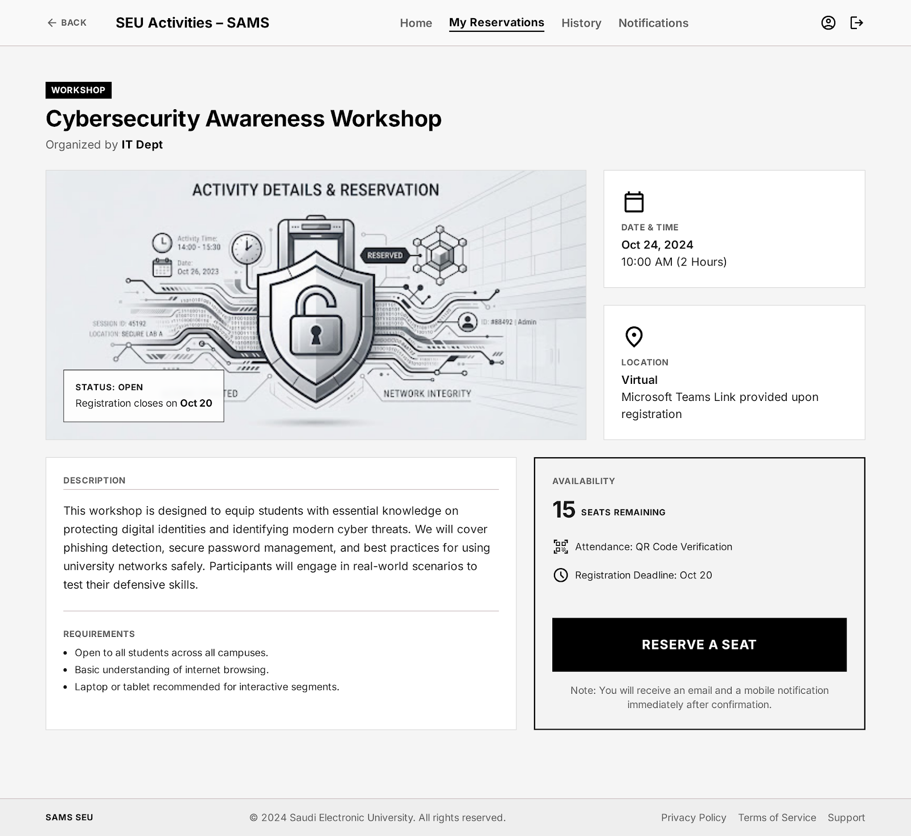
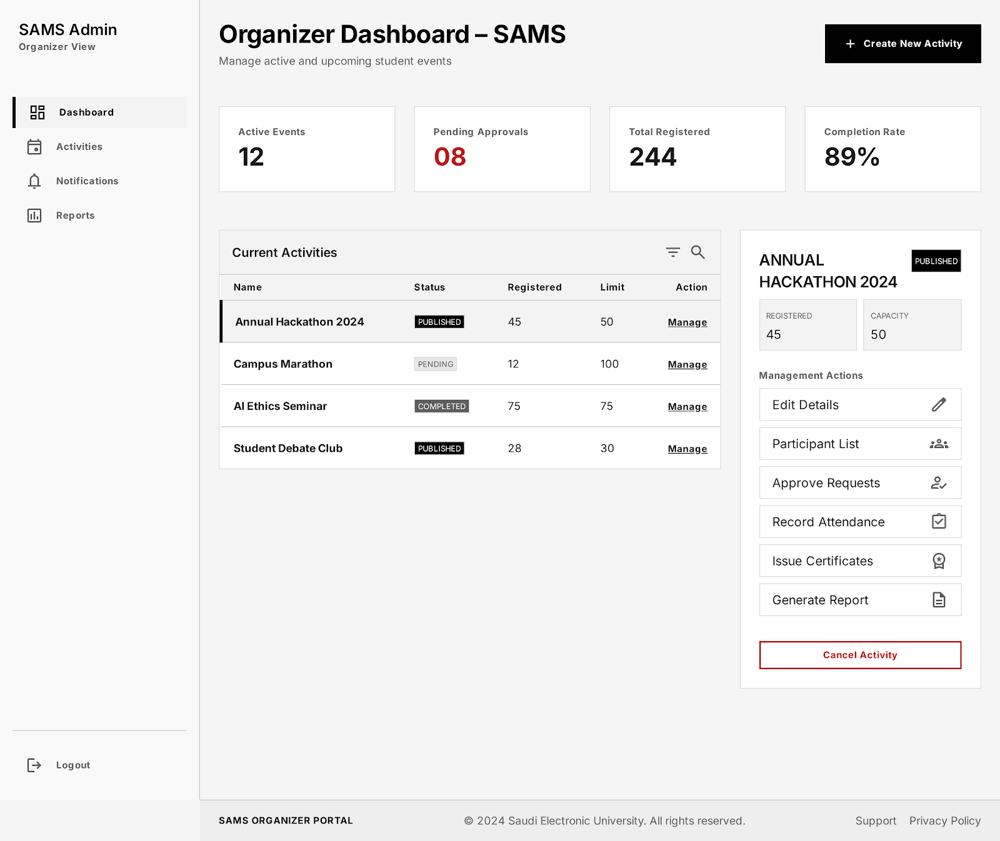

# Task 2 - Select ONE prototyping approach (Evolutionary Prototyping or Throwaway Prototyping). Develop low-fidelity prototypes for 3 main screens of the system and justify why your chosen approach is more appropriate for this project [2 marks].

**Selected Approach: Evolutionary Prototyping**

Evolutionary prototyping is selected for the Student Activities Management System. The first prototype will contain the main functions and basic screen layouts. It can then be improved gradually after receiving feedback from students, activity organizers, and the Student Affairs Department.

This approach is appropriate because SAMS includes several connected processes, such as activity registration, waiting lists, electronic attendance, notifications, certificates, and activity transcripts. Users may identify new needs after interacting with the early version. Evolutionary prototyping allows the development team to refine these functions without discarding the entire prototype.

**Screen 1: Student Activities Browser**

This screen allows students to search and browse available activities. They can filter the results by category, campus, or date and select an activity to view its full details. The navigation bar also provides access to reservations, notifications, and participation history.

**Screen 2: Activity Details and Reservation**

This screen presents the information students need before making a reservation. It displays the activity schedule, location, eligibility requirements, registration deadline, attendance method, and remaining capacity. When the activity is full, the reservation button can be replaced with a “Join Waiting List” button.

**Screen 3: Organizer Activity Management Dashboard**

This screen allows organizers to create and manage activities from one location. They can monitor registration numbers, edit activity information, approve students when approval is required, record attendance, issue certificates, and generate reports.

