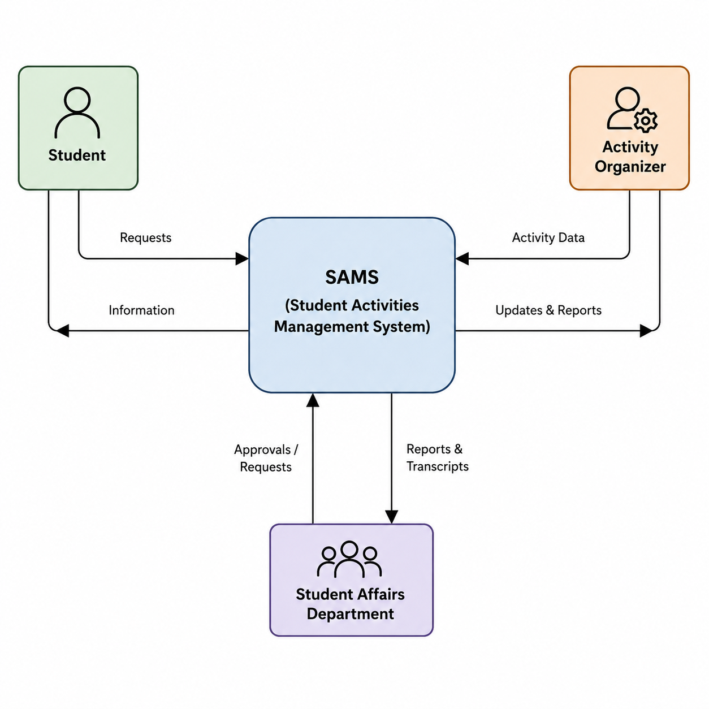
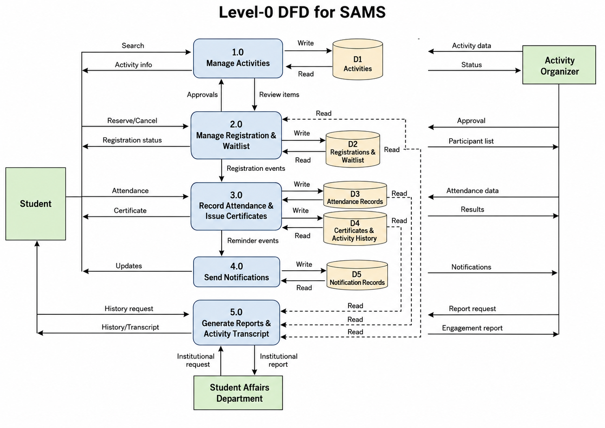

# Task 3 Develop the Data Flow Diagrams (DFDs): Context Diagram - Level-0 DFD - Three Level-1 DFD for 3 major processes [2.5 marks].

**Context Diagram for the Student Activities Management System**

The context diagram represents SAMS as one central process and shows its interaction with three external entities. Students send activity searches, reservations, cancellations, attendance information, and history requests. In return, they receive activity details, reservation updates, notifications, certificates, and activity transcripts.

Activity organizers provide activity information, registration conditions, approvals, attendance records, and report requests. The system returns participant lists, registration updates, attendance results, and engagement reports.

The Student Affairs Department manages categories, approves activities, requests institutional reports, and verifies activity transcripts. SAMS provides activities awaiting approval, university-wide participation statistics, reports, and student activity records. No internal processes or data stores are shown because the context diagram presents only the system boundary and its external data flows.

**Level-0 DFD**

