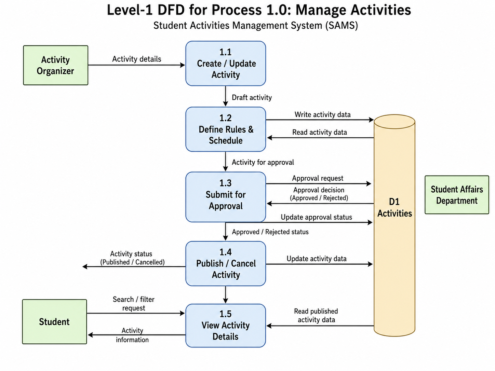

# Task 3 Develop the Data Flow Diagrams (DFDs): Context Diagram - Level-0 DFD - Three Level-1 DFD for 3 major processes [2.5 marks].

**Context Diagram for the Student Activities Management System**

The context diagram represents SAMS as one central process and shows its interaction with three external entities. Students send activity searches, reservations, cancellations, attendance information, and history requests. In return, they receive activity details, reservation updates, notifications, certificates, and activity transcripts.

Activity organizers provide activity information, registration conditions, approvals, attendance records, and report requests. The system returns participant lists, registration updates, attendance results, and engagement reports.

The Student Affairs Department manages categories, approves activities, requests institutional reports, and verifies activity transcripts. SAMS provides activities awaiting approval, university-wide participation statistics, reports, and student activity records. No internal processes or data stores are shown because the context diagram presents only the system boundary and its external data flows.

**Level-0 DFD**

**Level-1 DFD**

**Process 1.0: Manage Activities**

This process explains how activities are created and made available to students. The Activity Organizer enters the activity details through Process 1.1, including the title, description, location, and other basic information. Process 1.2 adds the schedule, participant limit, registration period, eligibility rules, and attendance method. The activity information is then stored in the Activities data store.

Process 1.3 submits the activity to the Student Affairs Department for review. The department approves or rejects the request, and the approval status is recorded. After approval, Process 1.4 allows the organizer to publish, update, or cancel the activity. Finally, Process 1.5 receives students’ search and filter requests, retrieves published activity data, and returns the relevant activity information.

