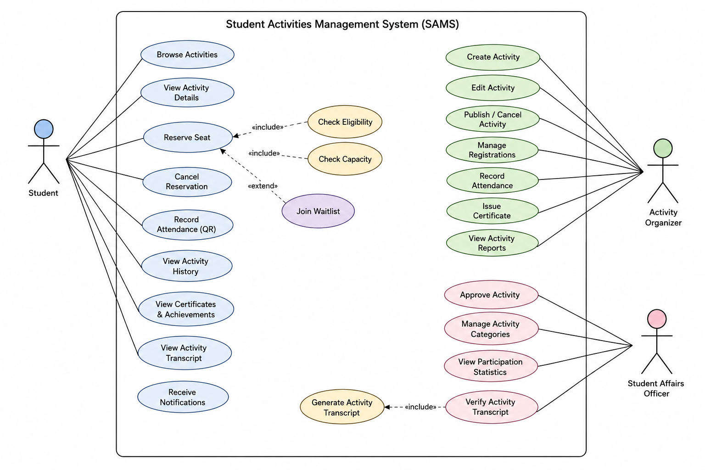

# Task 4 - Develop the Use Case Model: Identify all system actors - Create one complete Use Case Diagram - Fully document three use cases using the use case template [3 marks].

**System Actors**

An actor represents an external role that interacts with the system to achieve a specific goal.

| Actor | Role in the System |
|---|---|
| Student | Searches for activities, views details, reserves seats, cancels reservations, joins waiting lists, records attendance, receives notifications, and views participation records. |
| Activity Organizer | Creates and manages activities, handles registrations, records attendance, issues certificates, and generates activity reports. |
| Student Affairs Officer | Represents the Student Affairs Department by managing categories, approving activities, monitoring participation, generating institutional reports, and verifying activity transcripts. |

The QR code and notification functions are treated as parts of SAMS rather than separate actors because the scenario does not identify independent external systems for them.

**Use Case Diagram**

**Fully Documented Use Cases**

Use Case 1: Reserve a Seat

| Field | Description |
|---|---|
| Use Case Name | Reserve a Seat |
| Level | User goal |
| Primary Actor | Student |
| Supporting Actor | Activity Organizer, when approval is required |
| Stakeholders | The student needs a clear reservation result. The organizer needs an accurate participant list and capacity count. |
| Preconditions | The activity is published, registration is open, and the student is eligible to use the system. |
| Minimal Guarantee | No invalid or duplicate reservation is recorded. |
| Success Guarantee | The student receives a confirmed, pending, or waitlisted status, and the registration records are updated. |
| Trigger | The student selects the “Reserve a Seat” option. |

**Main Success Scenario**

The student opens the selected activity.

SAMS displays the activity details and registration conditions.

The student requests a seat.

The system checks the registration deadline.

The system verifies the student’s eligibility.

The system checks for an existing reservation.

The system checks the remaining activity capacity.

SAMS creates a confirmed reservation.

The participant list and available capacity are updated.

The student receives a registration confirmation.

**Extensions**

4a. The registration deadline has passed. The system rejects the request and displays the reason.

5a. The student does not meet the eligibility requirements. The request is rejected.

6a. The student already has a reservation. The system displays the existing status.

7a. The activity is full. The student is added to the waiting list.

7b. Organizer approval is required. The reservation is recorded as pending until the organizer makes a decision.

**Use Case 2: Create and Submit Activity**

| Field | Description |
|---|---|
| Use Case Name | Create and Submit Activity |
| Level | User goal |
| Primary Actor | Activity Organizer |
| Supporting Actor | Student Affairs Officer |
| Stakeholders | The organizer needs to create a complete activity. Student Affairs needs sufficient information to review it. Students need accurate activity details after publication. |
| Preconditions | The organizer is authorized to manage activities, and the required activity categories are available. |
| Minimal Guarantee | An incomplete activity is not submitted or published. A saved draft remains available for editing. |
| Success Guarantee | The activity is stored with a pending approval status and becomes available for Student Affairs review. |
| Trigger | The organizer selects “Create New Activity.” |

**Main Success Scenario**

The organizer selects the option to create an activity.

SAMS displays the activity form.

The organizer enters the activity title, description, category, date, time, and location.

The organizer defines the participant limit and registration period.

The organizer enters the eligibility requirements and attendance method.

The organizer indicates whether student registrations require approval.

SAMS validates the entered information.

The organizer submits the activity.

The system saves the activity with a pending approval status.

Student Affairs is notified that the activity requires review.

The organizer receives submission confirmation.

**Extensions**

3a. The activity is virtual. The organizer provides virtual location information.

7a. Required information is missing. The system identifies the missing fields.

7b. The dates are invalid. The system requests corrected dates.

8a. The organizer selects “Save as Draft.” The activity is stored without being submitted.

10a. Student Affairs rejects the activity. The system records the reason and notifies the organizer.

