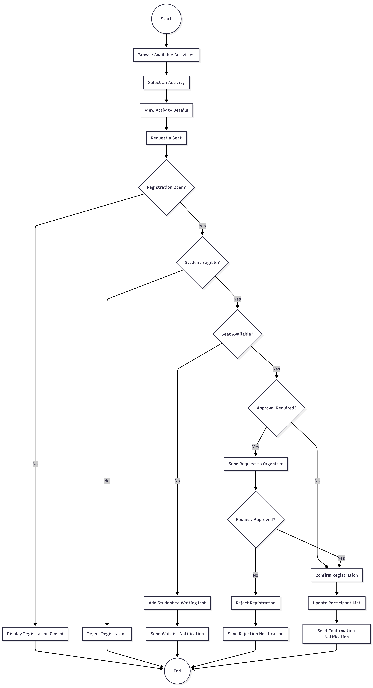
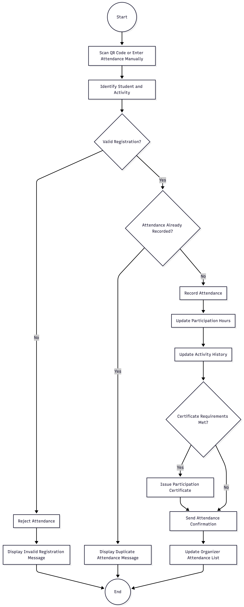

# Task 5 - Develop two UML Activity Diagrams for two major business processes [2 marks].

UML Activity Diagram 1: Student Activity Registration

The process begins when a student browses and selects an activity. SAMS checks the registration period, eligibility requirements, and available capacity. If the activity is full, the student is placed on the waiting list. When organizer approval is required, the request remains pending until a decision is made. A successful reservation updates the participant list and sends a confirmation notification.
UML Activity Diagram 2: Attendance and Certificate Issuance

The attendance process starts when the student scans a QR code or the organizer records attendance manually. SAMS verifies that the student has a valid registration and prevents duplicate attendance records. After successful validation, the system records attendance and updates participation hours and activity history. A certificate is issued when the required participation conditions are satisfied.
