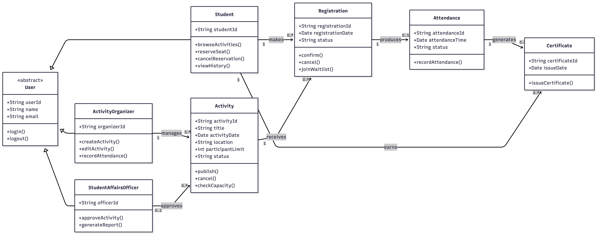

# Task 6 - Develop a UML Class Diagram including classes, attributes, methods, associations, multiplicities, and inheritance where appropriate [3 marks].

**Inheritance**

User is an abstract superclass containing the common information and operations shared by all users. Student, ActivityOrganizer, and StudentAffairsOfficer inherit these features and add functions related to their specific roles.

**Main Associations and Multiplicities**

An Activity Organizer can manage many activities, while each activity is managed by one organizer. An activity belongs to one category, but a category can contain many activities. A Student Affairs Officer may approve several activities.

The Registration class resolves the many-to-many relationship between students and activities. One student can create many registrations, and one activity can receive many registrations. A registration may also create one waiting-list entry when the activity is full.

Each registration may produce one attendance record. Valid attendance may result in one certificate. A student can receive several notifications and earn several achievements. Each student may also have one Activity Transcript that summarizes the student’s verified participation records.