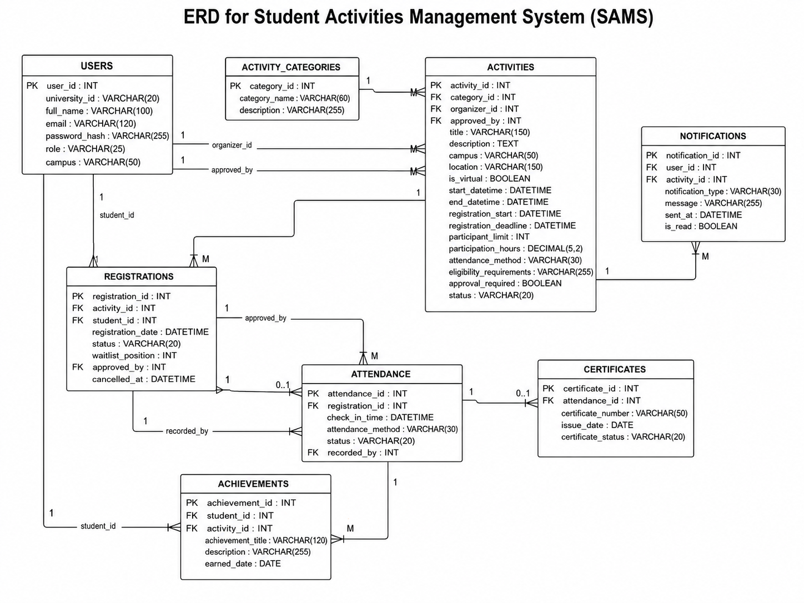

# Task 7 - Design the relational database, including tables, primary keys, foreign keys, appropriate data types, and normalization (up to at least Third Normal Form) [3 marks].

**1 - Database Tables**

| Table | Columns and Data Types | Keys |
|---|---|---|
| Users | user_id INT, university_id VARCHAR(20), full_name VARCHAR(100), email VARCHAR(120), password_hash VARCHAR(255), role VARCHAR(25), campus VARCHAR(50) | PK: user_id; UNIQUE: university_id, email |
| ActivityCategories | category_id INT, category_name VARCHAR(60), description VARCHAR(255) | PK: category_id; UNIQUE: category_name |
| Activities | activity_id INT, category_id INT, organizer_id INT, approved_by INT NULL, title VARCHAR(150), description TEXT, campus VARCHAR(50), location VARCHAR(150), is_virtual BOOLEAN, start_datetime DATETIME, end_datetime DATETIME, registration_start DATETIME, registration_deadline DATETIME, participant_limit INT, participation_hours DECIMAL(5,2), attendance_method VARCHAR(30), eligibility_requirements VARCHAR(255), approval_required BOOLEAN, status VARCHAR(20) | PK: activity_id; FK: category_id → ActivityCategories; organizer_id → Users; approved_by → Users |
| Registrations | registration_id INT, activity_id INT, student_id INT, registration_date DATETIME, status VARCHAR(20), waitlist_position INT NULL, approved_by INT NULL, cancelled_at DATETIME NULL | PK: registration_id; FK: activity_id → Activities; student_id → Users; approved_by → Users; UNIQUE: activity_id + student_id |
| Attendance | attendance_id INT, registration_id INT, check_in_time DATETIME, attendance_method VARCHAR(30), status VARCHAR(20), recorded_by INT NULL | PK: attendance_id; FK: registration_id → Registrations; recorded_by → Users; UNIQUE: registration_id |
| Certificates | certificate_id INT, attendance_id INT, certificate_number VARCHAR(50), issue_date DATE, certificate_status VARCHAR(20) | PK: certificate_id; FK: attendance_id → Attendance; UNIQUE: attendance_id, certificate_number |
| Achievements | achievement_id INT, student_id INT, activity_id INT NULL, achievement_title VARCHAR(120), description VARCHAR(255), earned_date DATE | PK: achievement_id; FK: student_id → Users; activity_id → Activities |
| Notifications | notification_id INT, user_id INT, activity_id INT NULL, notification_type VARCHAR(30), message VARCHAR(255), sent_at DATETIME, is_read BOOLEAN | PK: notification_id; FK: user_id → Users; activity_id → Activities |

&nbsp;
**2 - Relational Schema**

&nbsp;
**3 - Main Relationships**
One activity category can classify many activities, while each activity belongs to one category.

One organizer can manage many activities, while each activity has one organizer.

Students and activities have a many-to-many relationship resolved through the Registrations table.

One registration may have one attendance record.

One attendance record may generate one certificate.

One student may receive many notifications and achievements.

A waitlisted student is represented by a registration with the status Waitlisted and a waitlist position.
&nbsp;
**4 - Important Constraints**
role should be limited to Student, Organizer, or Student Affairs Officer.

participant_limit must be greater than zero.

The activity end date must be later than its start date.

The registration deadline must be before the activity begins.

A student cannot register for the same activity more than once.

Each registration can have no more than one attendance record.

Activity status may be Draft, Pending, Approved, Published, Cancelled, or Completed.

Registration status may be Pending, Confirmed, Waitlisted, Rejected, or Cancelled.